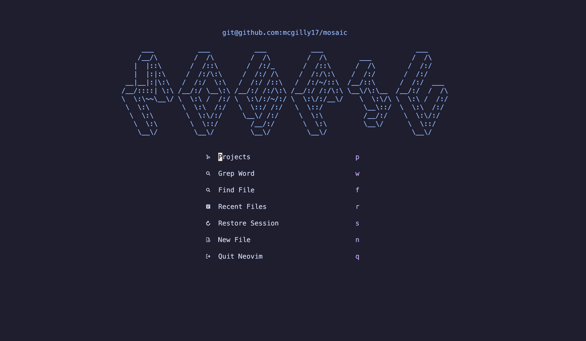
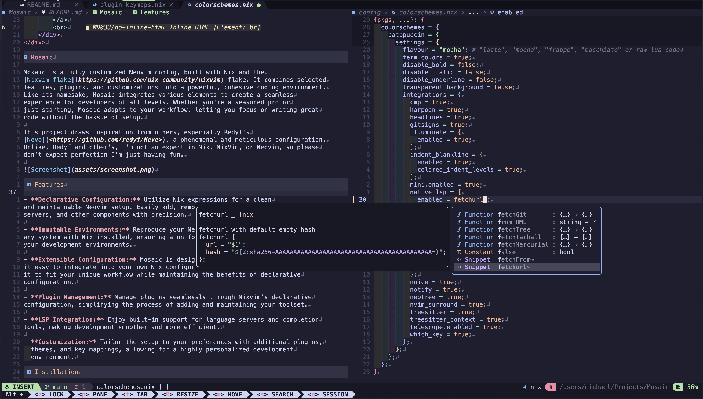

<div align="center">
    <a href='#'></a>
    <br>
    <br>
    <div>
        <a href="https://github.com/mcgilly17/Mosaic/issues">
            
        </a>
        <a href="https://github.com/mcgilly17/Mosaic">
            
        </a>
        <a href="https://github.com/mcgilly17/Mosaic/blob/main/LICENCE">
            
        </a>
        <br>
    </div>
</div>

# Mosaic

Mosaic is a fully customized Neovim config, built with Nix and the
[Nixvim flake](https://github.com/nix-community/nixvim) flake. It combines selected
features, plugins, and customizations into a powerful, cohesive coding environment.
Like its namesake, Mosaic integrates various elements to create a seamless
experience for developers of all levels. Whether you're a seasoned pro or
just starting, Mosaic adapts to your workflow, letting you focus on writing great
code without the hassle of setup.

This project draws inspiration from others, especially Redyf's
[Neve](<https://github.com/redyf/Neve>), a phenomenal and meticulous configuration.
Unlike, Redyf and other's, I'm not an expert in Nix, NixVim, or Neovim, so please
don’t expect perfection—I'm just having fun.
<details>
    <summary>Screenshots</summary>



</details>

## Features

- **Declarative Configuration:** Utilize Nix expressions for a clean
and maintainable Neovim setup. Easily add, remove, or update plugins, LSP
servers, and other components with precision.

- **Immutable Environments:** Reproduce your Neovim setup effortlessly on
any system with Nix installed, ensuring a uniform experience across all
your development environments.

- **Extensible Configuration:** Mosaic is designed to be fully extensible, making
it easy to integrate into your own Nix configurations. Extend or customize
it to fit your unique workflow while maintaining the benefits of declarative
configuration.

- **Plugin Management:** Manage plugins seamlessly through Nixvim's declarative
configuration, simplifying the process of adding and maintaining your toolset.

- **LSP Integration:** Enjoy built-in support for language servers and completion
tools, making development smoother and more efficient.

- **Customization:** Tailor the setup to your preferences with additional plugins,
  themes, and key mappings, allowing for a highly personalized development
  environment.

## Installation

Installing and using Mosaic is pretty straight forward, but you have many options!

### Try it out

You can first just try out the config by running the following:

```bash
nix run github:mcgilly17/Mosaic
```

### Direct Install

You can add Mosaic as a flake input to you systems nix configuration and adding to
environment.systemPackages or home.packages

```nix
{
  inputs.mosaic.url = "github:mcgilly17/Mosaic";

  outputs = { mosaic }: {

    # Add to your system packages or home-manager packages.
    environent.systemPackages = [
      mosaic.packages.${pkgs.system}.default
    ];

    # Home manager installation might work like this
    # assuming you are in a different file:
    home.packages = [
      inputs.mosaic.packages.${pkgs.system}.default
    ];

  };
}
```

### Overlay Installation

You can add Mosaic as an overlay to nixpkgs

```nix
# This one brings our custom packages from the 'pkgs' directory
overlays.additions = final: _prev: {
  mosaic = inputs.mosaic.packages.${final.pkgs.system}.default;
};

# Mosaic is now available in pkgs wherever you want to use it
home.packages = [
  pkgs.mosaic
];

```

## Extending Mosaic

I am **attempting** to make Mosaic fully extensible. By that I mean, anyone
should be able to bring Mosaic into their configs and with relative ease: add,
remove and overwrite any setting or plugin. There are some limitations right now,
mainly with extraConfigLua. If anyone knows how to make Mosaic more modular,
please don't hesitate to raise an issue / discussion / PR.

### Simple Extension

Basic level configurations and settings updates can be done as follows:j

```nix
home.packages = [
  (pkgs.mosaic.extend {
    config = {
      # https://nix-community.github.io/nixvim/NeovimOptions/index.html
      # All options are available at the link above.

      # Some core configs for nixvim that are not set in mosaic
      enableMan = true;
      viAlias = true;
      vimAlias = true;

      # In Mosaic, some of the plugins are installed manually
      # using vimUtils.buildVimPlugin. In those coses, in order
      # to disable the plugin you have access to plugs.pluginNAME
      plugs.sidebar.enable = false;

      plugins = {
        # all available LSPs to enable can be found in the nixvim docs
        # https://nix-community.github.io/nixvim/plugins/lsp/servers/beancount/index.html
        lsp.servers = {
          # You can enable new language servers or disable existing ones as follows
          beancount.enable = true;
        };

        # If there is a plugin you would like to install that isn't
        # already added in Mosaic, you can add it here (or commit a PR!!)
        # all plugins for nixvim that can be enabled can be found here:
        # https://nix-community.github.io/nixvim/plugins/barbecue/index.html
        barbeque.enable = true;

        # It's not just about enabling or disabling plugins, you can
        # also overwrite settings.
        bufferline.settings.options.separator_style = "thick";
      };

      keymaps = [
        {
          mode = ["i" "v"];
          action = "<Esc>";
          key = "oo";
        }
      ];
    };
  })
];
```

### Other Plugins

Many times Nixvim wont have a plugin immediately available to install. In those
cases you can extend Mosiac and install the plugin. Or feel free to raise a PR
with the new plugin installed!

Below you will see two examples of installation. One by simply adding it from
pkgs.vimPlugins and the other when its not available and needs to be built.

The example of "building a plugin" below is what I use to install Fugit2. It's
an odd example as I couldn't work out a way to install it in Mosaic given its
need to add the path to libgit2 which can only installed in my nix configs.

```nix
home.packages = [
  (pkgs.mosaic.extend {
    #### Rest of your configs #####

    config = {
      extraPlugins = with pkgs.vimPlugins; [
          # If the plugin is available in pkgs.vimPlugins (check on nixpkgs)
          # then it can be added by name, for example:
          nvim-surround

          # If the plugin doesnt exist in vimPlugins, then you can build
          # the plugin as you can see below. An easy way to get the sha256
          # is to leave it empty, run a check flake and it will error with
          # the right sha for you!
          (buildVimPlugin {
              pname = "fugit2.nvim";
              version = "0.2.1";
              src = pkgs.fetchFromGitHub {
                owner = "SuperBo";
                repo = "fugit2.nvim";
                rev = "e8b262d3f974a301b9efae98a571e6c9e635ab16";
                sha256 = "sha256-U9Ve7mgJlQwArgDBOXC2ezaaG7zIOJalLEl5Hyw2jMA=";
              };
          })
      ];
      extraConfigLua = ''
          require('fugit2').setup{
              libgit2_path = '${pkgs.libgit2.outPath}/lib/libgit2.1.7.2.dylib',
              external_diffview = true,
          }
      '';
    };
  })
];
```

## Structure

Here is a quick description of some of the most important folders and files in Mosaic

- **config/default.nix** The core file where all plugins are enabled.

- **config/sets.nix** Add, remove, or adjust options and settings in this file.

- **config/keymaps/*** Customize key mappings to boost productivity.

- **config/lsp/*** Configure your preferred Language Servers here.

- **config/completion/*** Manage completion and snippets.

- **config/plugins/*** Additional plugins that arent sorted into folders

## Support

Encountered an issue or have a question? Visit the
[Issue Tracker](<https://github.com/mcgilly17/Mosaic/issues>)

## Contribution

Contributions are encouraged! Please
[open an issue](<https://github.com/mcgilly17/Mosaic/issues>) to report problems,
suggest improvements, or submit pull requests to add new features to Mosaic.

## License

This project is licensed under the [MIT License](LICENCE). See the LICENSE file
for more details.
